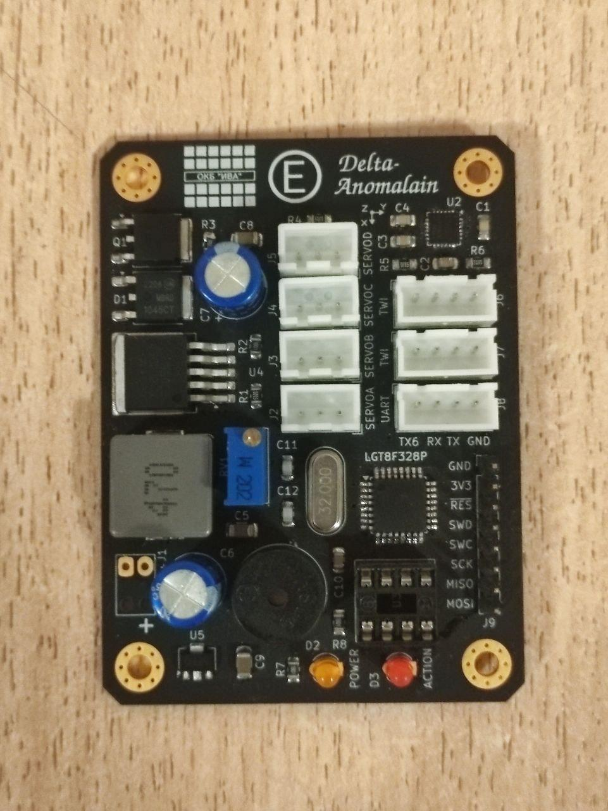
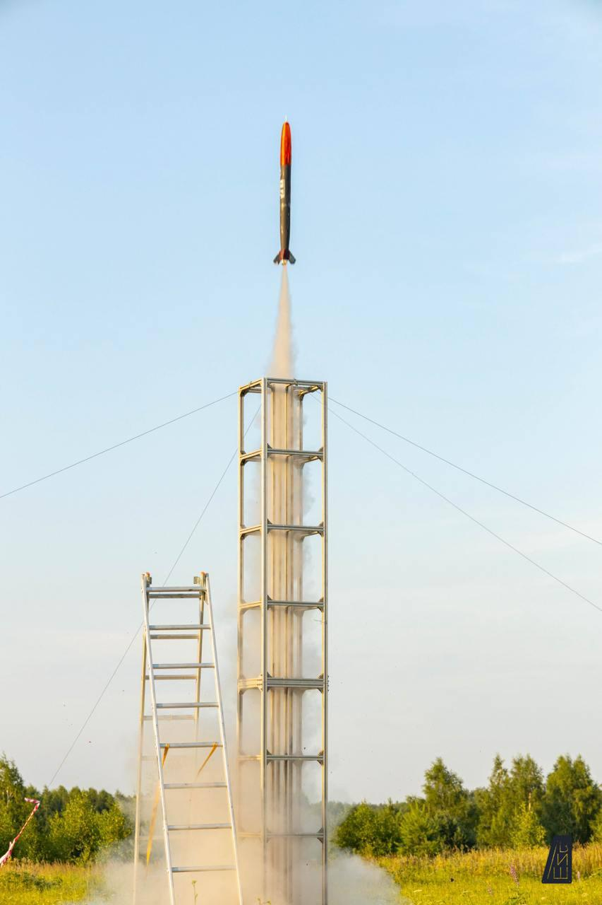
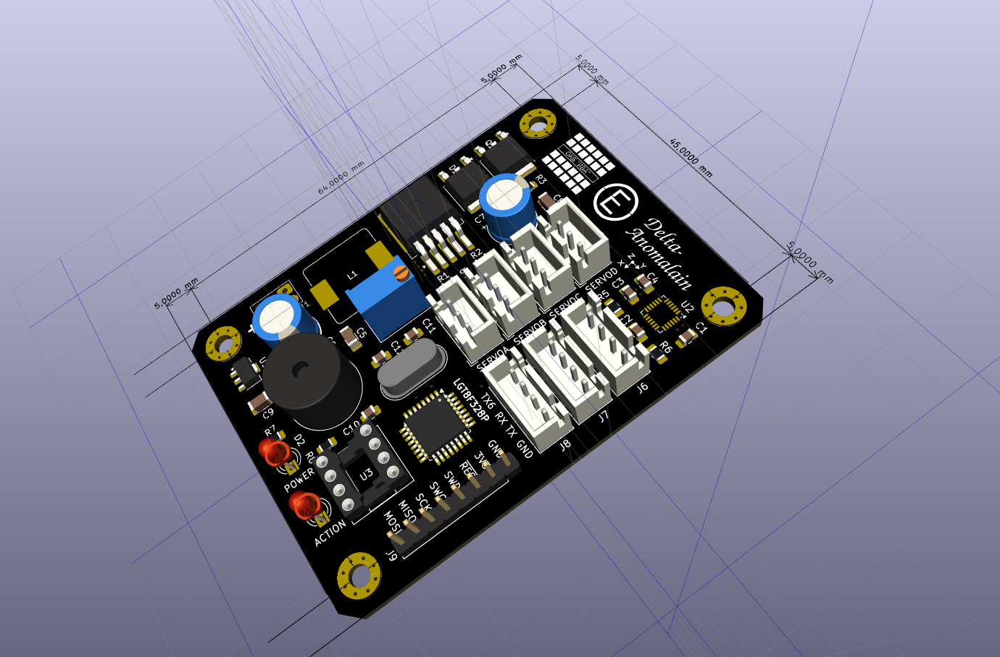

# Barsotion GBK DeltaAnomalain
Board computer for OKB Iva "Kilka" rocket, 2024

## Parameters
- Microcontroller: LGT8X328P
- Clock frequency: 32MHz
- Gyroscope: on-board MPU6050 (I2C)
- Barometer: external, 2x BMP388 (I2C)
- Memory: 8MB SPI NOR Flash

The clock frequency is 32 MHz provided by design, however before the flight 07.07.2024 we need to reduce it to 16 MHz, unless the computer was unstable in working.

## Software
- [DeltaAnomalain flight software](https://github.com/Barsy-Barsevich/KILKA_Soft)

## Continious progress
- [Previous version: Barsotion GBK GammaAnomalain](https://github.com/Barsy-Barsevich/Barsotion-GBK-GammaAnomalain)
- [Next version: Barsotion-EA (GBK EpsilonAnomalain](https://github.com/Barsy-Barsevich/Barsotion-EA)

